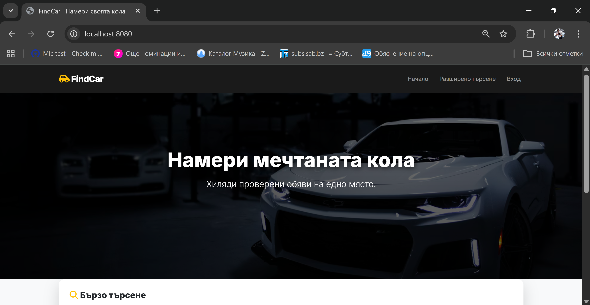
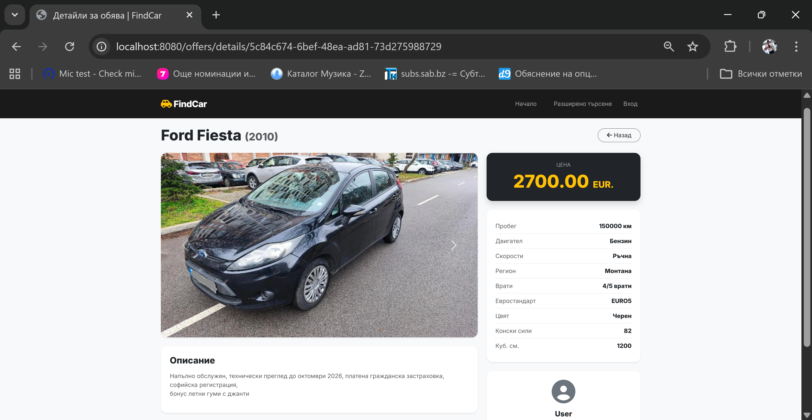
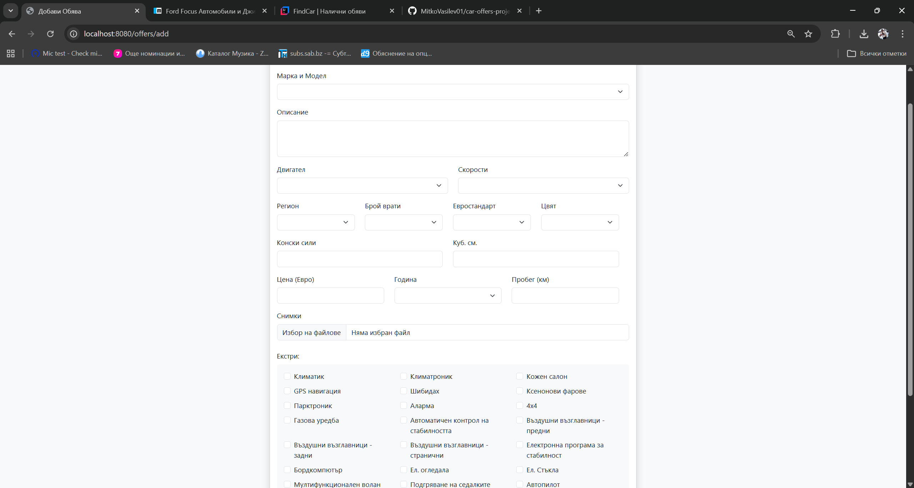
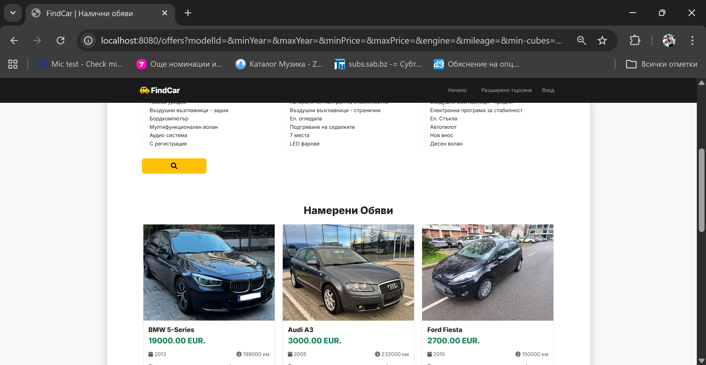

# FindCar - Car Trading Platform

A full-stack web application for buying and selling cars, built with **Java Spring Boot**, **MySQL**, and **Thymeleaf**.

##  Features
- **User Authentication:** Secure registration and login using Spring Security.
- **Offer Management:** Create, view, edit, and delete car offers (CRUD operations).
- **Image Upload:** Local file storage for multiple car images with automatic thumbnail selection.
- **Dynamic Search & Filtering:** Complex search by Brand, Model, Price, Year, Engine, and Extras.
- **Relational Database:** Designed with Hibernate (One-to-Many, Many-to-Many relationships).
- **Responsive UI:** Built with Bootstrap and custom CSS for a modern look.

##  Tech Stack
- **Backend:** Java 17, Spring Boot 3.4.2, Spring MVC, Spring Data JPA, Spring Security.
- **Database:** MySQL, Hibernate ORM.
- **Frontend:** Thymeleaf, HTML5, CSS3, Bootstrap 5.
- **Tools:** Maven, Git, IntelliJ IDEA, Lombok.

##  How to Run Locally 
1. Clone the repository:
   ```bash 
   git clone https://github.com/MitkoVasilev01/car-offers-project.git


2. Create the Database:
Open your MySQL terminal or MySQL Workbench and execute the following query to create an empty schema:
  CREATE DATABASE car_market_db;

3. Configure Database Credentials:
Open src/main/resources/application.properties and update the database connection details with your local MySQL credentials:
spring.datasource.url=jdbc:mysql://localhost:3306/car_market_db
spring.datasource.username=your_mysql_username
spring.datasource.password=your_mysql_password

4. You can run the application directly from your IDE (IntelliJ IDEA) by executing the main method in ChooseYourVehicleApplication.java, or via terminal:
mvn spring-boot:run

5. Access the Web Interface:
Open your browser and navigate to: http://localhost:8080

Demo Credentials for Testing
On the first run, the database is automatically seeded with demo data (brands, models, and 4 high-resolution car offers). You can use the following default administrator credentials to test all features (editing, and deleting offers):

    Username: admin
    Password: 13579Ii...

Screenshots:

**Home page:**


**Offer details:**


**Offer add:**


**Offers all:**



